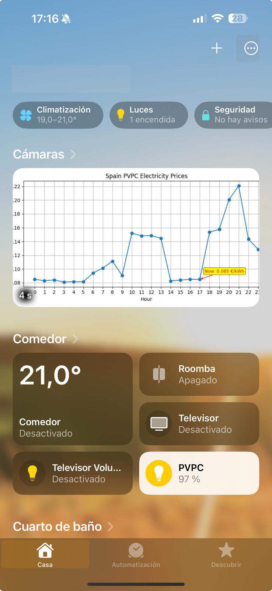
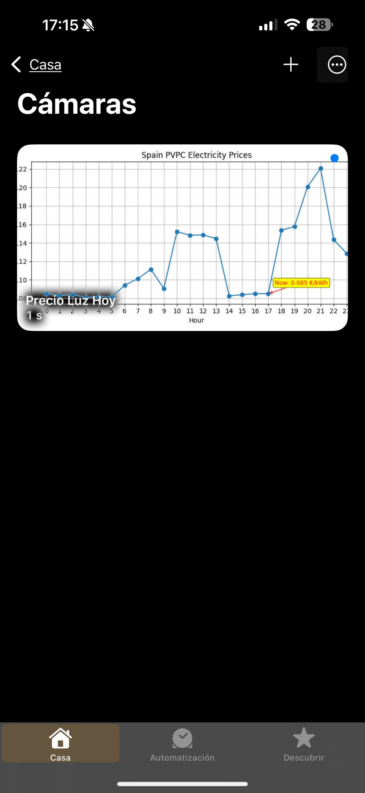

# Spain Electricity Price Graph

## Getting started

Docker image to broadcast Spain electricity prices as a camara feed to use with [Homebridge Camera FFmpeg](https://github.com/homebridge-plugins/homebridge-camera-ffmpeg) and integrate it into HomeKit.

Prices are loaded from **Red Eléctrica** [ESIOS API](https://api.esios.ree.es/). You will need a *personal token* (you can request it [here](https://api.esios.ree.es/)).

<table>
<tr>
<td valign="top">
<i>Home App</i><br>

</td>
<td valign="top">
<i>Camera Widget</i><br>

</td>
</tr>
</table>


## Project structure

```
project-root/
├── docker-compose.yml
├── README.md
└── prices/
    ├── Dockerfile
    ├── requirements.txt
    ├── prices_server.py
    ├── prices_generator.py
    └── images/  # Directory to hold price png's
```

- **docker-compose.yml**: docker compose configuration
- **prices/Dockerfile**: docker build configuration

## Installation

1.  Copy files into your docker installation 
2.  Execute
```
docker compose up --build -d
```

## Test Installation

Open your favourite browser to:
1. *Camera feed*
```
http://<your-ip>:8080/prices 
````
2. *Camera snapshot*
```
http://<your-ip>:8080/prices.png
````

## Docker compose environment values

Change values as your needs:
```
version: '3.8'

services:
  pvpc_prices_server:
    build: ./prices
    container_name: pvpc-prices-server
    restart: unless-stopped
    ports:
      - "8080:8080"
    environment:
      - TZ=Europe/Madrid
      - ESIOS_API_TOKEN=_your_esios_token_here_

```

## Integration with your homebridge-camera-ffmpeg plugin

Once you have your docker image up, install the homebridge plugin [Homebridge Camera FFmpeg](https://github.com/homebridge-plugins/homebridge-camera-ffmpeg) and configure it as follows:

- **source**: 
  ```-f mjpeg -i http://<your-ip>:8080/prices```
- **stillImageSource**: ```-i http://<your-ip>:8080/prices.png```
- **maxStreams**: ```2```
- **maxWidth**: ```800```
- **maxHeight**: ```600```
- **maxFPS**: ```1```